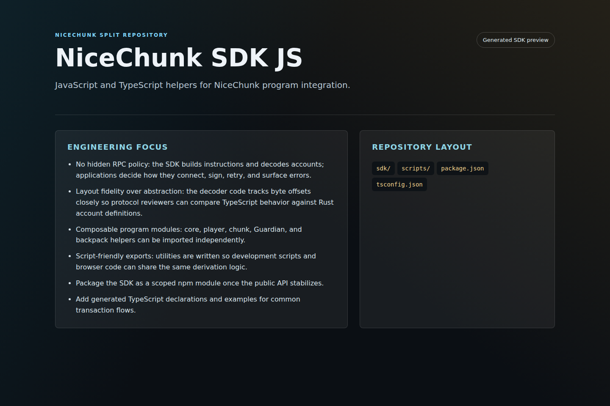

# NiceChunk SDK JS

JavaScript and TypeScript helpers for NiceChunk program integration.

## Project Overview

This repository provides the JavaScript and TypeScript integration layer for NiceChunk. It contains PDA derivation helpers, instruction builders, account decoders, constants, and script utilities used by browser code, command-line tools, and protocol tests.

The SDK exists to keep program integration consistent. Rather than duplicating offsets, magic bytes, and seed rules across pages and scripts, callers import one documented surface that matches the current program layouts.

It is deliberately small and transparent. The code favors explicit buffers and public constants so developers can inspect every byte sent to or read from Solana accounts.

## System Principles

- No hidden RPC policy: the SDK builds instructions and decodes accounts; applications decide how they connect, sign, retry, and surface errors.
- Layout fidelity over abstraction: the decoder code tracks byte offsets closely so protocol reviewers can compare TypeScript behavior against Rust account definitions.
- Composable program modules: core, player, chunk, Guardian, and backpack helpers can be imported independently.
- Script-friendly exports: utilities are written so development scripts and browser code can share the same derivation logic.

## How It Works

- Import the module for the program surface you need, then derive PDAs and build transaction instructions from typed inputs.
- Decode returned account data using the matching decoder before making UI or gameplay decisions.
- Use environment variables for program ID overrides during devnet or local validator testing.
- Keep SDK changes paired with program layout changes to prevent clients from silently reading stale offsets.

## Why This Project Matters

A blockchain game fails quickly if every integration point hand-rolls its own byte offsets. This SDK gives NiceChunk a single integration vocabulary for scripts, pages, tests, and external developers.

A standalone SDK repository also gives other projects a narrow dependency. They can integrate world state, account decoding, or marketplace operations without cloning the full web client.

## Repository Layout

- `sdk/`
- `scripts/`
- `package.json`
- `tsconfig.json`

## Development Workflow

1. Clone the repository and inspect the focused source tree before changing shared contracts or generated artifacts.
2. Keep changes scoped to the domain of this repository. Cross-domain changes should be coordinated through the matching split repositories.
3. Run the smallest meaningful validation for the touched surface: build checks for programs, browser checks for pages, or fixture checks for deterministic libraries.
4. Update screenshots and documentation when behavior, visible UI, public constants, or developer-facing workflows change.

## Future Development Direction

- Package the SDK as a scoped npm module once the public API stabilizes.
- Add generated TypeScript declarations and examples for common transaction flows.
- Introduce compatibility tests that compare SDK decoders against serialized Rust fixture accounts.
- Split browser-safe and Node-only helpers if package consumers need stricter bundling boundaries.

## Maintenance Notes

This repository is a focused split from the main NiceChunk working tree. Keep the public surface explicit: avoid committing private keys, wallet files, deployment-only scripts, machine-specific configuration, or generated build artifacts. Runtime user-facing copy should stay behind the i18n layer where the project has an i18n surface.
